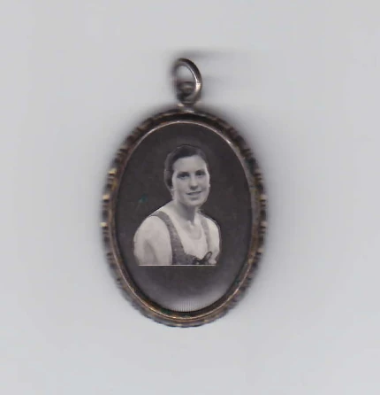

# Willibald Hausdorf

Diese Daten sind unvollständig, für Korrekturen oder weitere Informationen bitte an uns wenden.

## Persönliche Daten

Geboren: 11.02.1890 \
Geburtsort: Berlin \
Nationalität: Deutsch \
Beruf: Zahnarzt \
Religion: Katholisch

Mutter: Martha Hausdorf \
Vater: Robert Hausdorf

Brüder: Hans Hausdorf

## Haftzeit

Häftlingsnummern: 1407, 5599, 111494

Festnahmegrund: Betrug \
War in: KZ Buchenwald  \
mit Häftlingsnummer: 5599 \
Zeit im KZ Buchenwald: 02.01/1940 -> 02.05.1942

## Effekten

 \
_Ein Effekt von Willibald Hausdorf ist dieser Anhänger wo ein Bild von einer Frau drauf ist._

